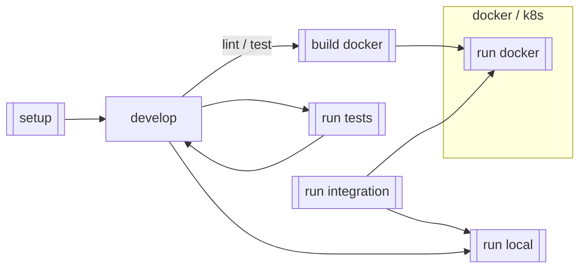

# CONTRIBUTING

> **_NOTE:_**
> For compliance reasons, all pull requests must be submitted with a Jira ID
> as a part of the pull request.
>
> You should include the Jira ID near the beginning of the title
> for better readability.
>
> For example:  
> `[XX-1234]: update CONTRIBUTING.md to include Jira IDs in PR titles`
>
> If there is more than one relevant ticket, include all associated Jira IDs.
>
> For example:  
> `[WM-1997] [WM-2002] [WM-2005]: fix for many bugs with the same root cause`
>

This section describes the steps necessary to finish setting up and
contributing to this repo.
If you would like more information about the design and reasons "why"
this repo is structured like it is,
please continue reading the [DESIGN.md](./DESIGN.md)-document located in
this directory to get your bearings for the anatomy of the service
and where the associated code lives.

This document assumes you've completed the steps located
in [Environment setup](./README.md#environment-setup) for how to `setup` and `run` the service.
If you haven't completed those steps yet,
please go back and make sure you can successfully run the service
from your local environment.

If you have questions or run into issues not covered
by the documentation in this repo,
please see the [Frequently Asked Questions](#frequently-asked-questions-faq) section
in this document.
If your question is not answered there, additional help resources can be found
at the bottom of this document.

## Developer convenience scripts

To help accelerate interacting with this repo,
there are a series of scripts available in the `./scripts` directory.



The double walled boxes in the diagram above represent scripts
that are available in the `./scripts` directory.

Each script is outfitted with a help and usage guide,
and the scripts are tied into the build process (where possible)
to help ensure they continue to run successfully.

For more information about the scripts,
please see the [./scripts/README.md](./scripts/README.md).

## Developing `terra-app-manager`

### Setting up IntelliJ IDEA (2023.3.4)

With IntelliJ IDEA open, perform the following steps to set up your IDE:

1. Select `File` => `Open ...`
2. Select the root directory of this repo on your local filesystem  
   (e.g. `~/workbench/terra-app-manager`)
3. Click `Open`

IntelliJ will detect that this is a `gradle`-based project and
start compiling your repo.

### `admin`-endpoint security setup

Following the details outlined in the [DESIGN.md](./DESIGN.md),
this service assumes all requests are authenticated by the time they reach this service.
To test any functionality that depends on this capability locally,
you need to make sure the Apache proxy is running locally.

The `/admin`-endpoints are locked down to only allow specific service accounts to access them and
are [configured in helm](https://github.com/broadinstitute/terra-helmfile)
with each release.

As a part of running `./scripts`,
the `SERVICE_ACCOUNT_ADMINS` are configured to be `@USER@broadinstitute.org`.

If you wish to impersonate an actual service account,
you will need to export `SERVICE_ACCOUNT_ADMINS` into the terminal that
you are running `service` from with the desired list values.

Below details how to impersonate the `appmanager-dev` service account.

#### Imperonsating a Service Account for `/admin` access
To impersonate service account in development, one must:

```shell
gcloud config set auth/impersonate_service_account appmanager-dev@broad-dsde-dev.iam.gserviceaccount.com
export GCLOUD_ACCESS_TOKEN=$(gcloud auth print-access-token)
```

The `GCLOUD_ACCESS_TOKEN` can then be used in the swagger-ui to authenticate.

If you'd like to see the contents of the google bearer token, you can use the following command:

```shell
curl "https://oauth2.googleapis.com/tokeninfo?access_token=$GCLOUD_ACCESS_TOKEN"
```

And to STOP impersonating a service_account, you need to run the following:

```shell
gcloud config unset auth/impersonate_service_account
```

## Frequently Asked Questions (FAQ)

(build out this section based on questions asked of the team)

### How do I add a new API endpoint?

New endpoints starts in [openapi.yml](./service/src/main/resources/api/openapi.yml).

Add and/or modify the desired endpoints in this document.
For documentation on `openapi` document structure,
[please start here](https://swagger.io/docs/specification/basic-structure/).

> **NOTE: This is our public facing contract.**   
> Changes to this must be considered carefully for version management.
> See [API Versioning](./docs/api_versioning.md)

From here, run the following command to validate and generate the necessary `service/`
[interfaces](./service/build/swagger-code/src/main/java/bio/terra/appmanager/api),
[models](./service/build/swagger-code/src/main/java/bio/terra/appmanager/model), and
[`client/` code](./client/build/swagger-code/src/main/java/bio/terra/appmanager).

```shell
./scripts/build -t project
```

## Additional questions

The [Interactive Analysis Team](https://github.com/orgs/DataBiosphere/teams/broad-interactive-analysis)
is responsible for stewarding this repo.

Additional questions can be directed to
the [#dsp-interactive-analysis](https://broadinstitute.slack.com/archives/CA3NP1733/).
