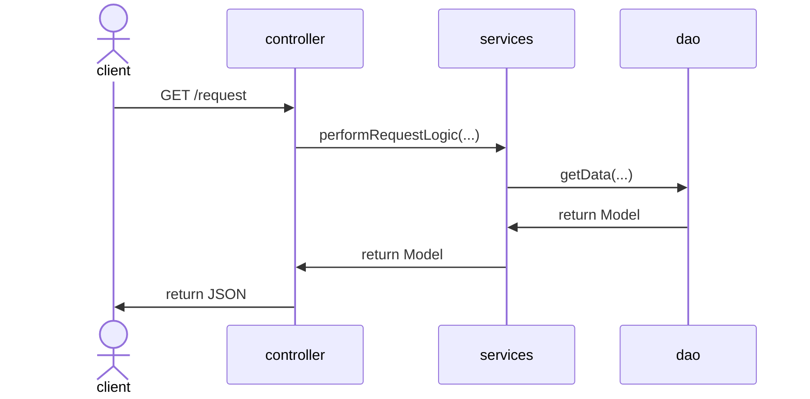

# service/ Design

Terra services are generally organized into and process requests through 3 layers,

- `controller/`,  
  Controllers handle api requests and responses.
- `service/` and  
  Services implement all business logic.
- `dao/` (data access object).  
  DAOs implement data persistence and querying.

Transactions are extremely important in ensuring API consistency,
especially across service boundaries.
Please be sure to read more about transactions and how to use them with this
architecture in [./transactions](./transactions.md)

## `controller/`

Controllers are the api entry point to the service.
[OpenAPI](../service/src/main/resources/api/openapi.yml) is used to
[generate](../service/generators.gradle) `*Api` interfaces which are implemented by
[controller/](../service/src/main/java/bio/terra/appmanager/controller) classes.
In this way we can craft a service's api and have the implementation flow
from there. Alternatively we could use java annotations on controller classes
to generate OpenAPI but that tends to lead to a poor API because we think
about the api usage second (or not at all).

Controllers are generally responsible for

* Resolving the user if required
* Checking access control
* Translation between API service-model object representations
* Making `service/` calls
* Translating `service/` responses and errors to API responses and status codes

Controllers talk to `services/`.
It should be an exceptional situation that they talk directly to DAOs.

**Note on access control**:
There can be some debate on whether this could be elsewhere.
Certainly more complicated or cross resource access control checks
can be elsewhere.

Pushing access control checks down to the service layer generally
make services less reusable.

The most important thing about access control checks is that
they are implemented consistently and readably to avoid mistakes.

## `service/`

- The service layer handles all business logic.
- If it is interesting, the code for it probably lives here.
- If it is coordinating anything, the code for it probably lives here.
- If it is making a decision, the code for it probably lives here.

The service layer is the transaction boundary
(see [transactions](transactions.md) for more details).

Services talk to other services and DAOs.

## `dao/`

DAOs (or data access objects) know how to do data things.

- Reading or writing to databases.
- Accessing other Terra remote-services.

DAOs do not make decisions.
They get information for the service layer to use to make decisions.
These objects are responsible for returning undigested information.

DAOs are the bottom layer and should not call other DAOs or services.
